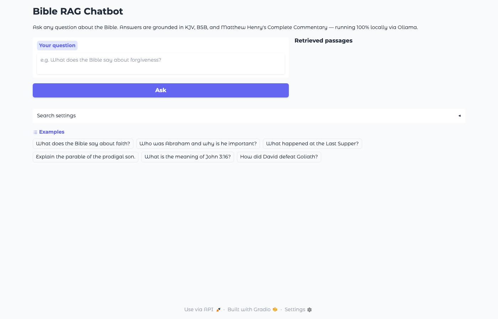
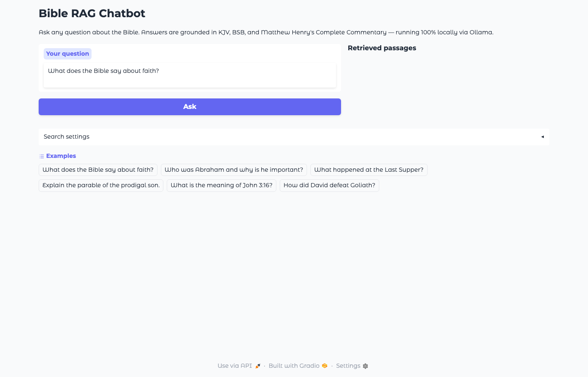
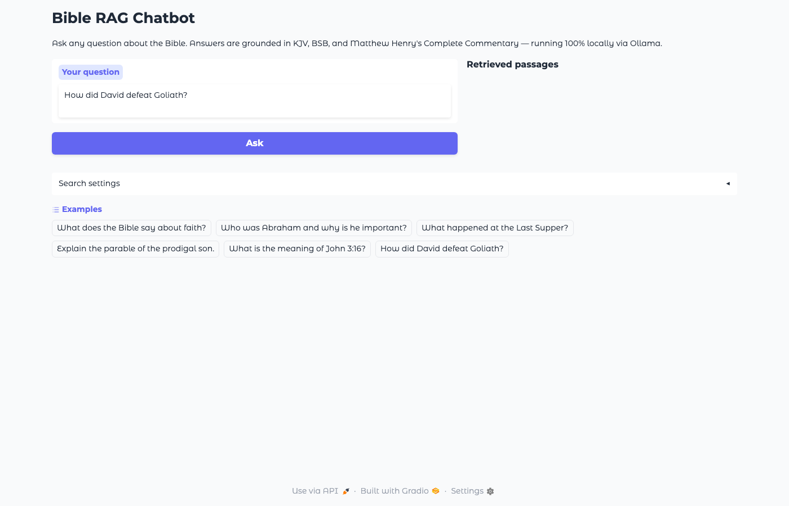
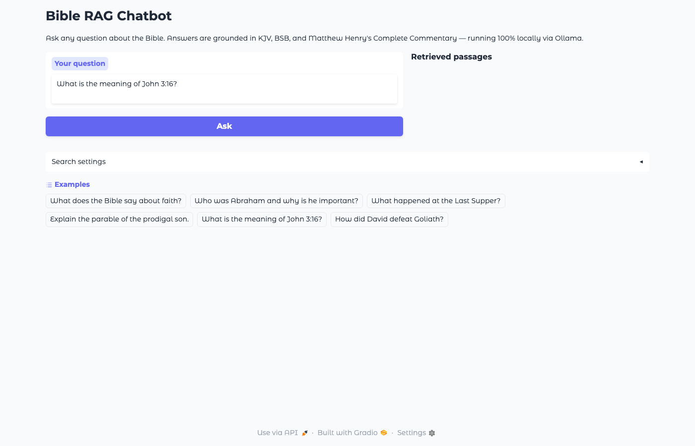

# Bible RAG Chatbot

A locally-hosted question-answering chatbot grounded in the Bible. Ask any question and receive cited answers drawn from two Bible translations and Matthew Henry's 18th-century commentary — no API keys, no internet connection required after setup.



## Features

- **Semantic search** across 367,000+ indexed passages using sentence-transformers
- **Two translations** — KJV and BSB — with automatic deduplication so the same verse isn't surfaced twice
- **Matthew Henry's Complete Commentary** (1708–1714) — 1,189 chapters chunked and embedded
- **Cross-reference expansion** — 344,800 verse-pair links from OpenBible.info augment retrieval with theological connections
- **Fully local** — llama3.2 via Ollama, no data leaves your machine
- **Source panel** — every answer shows the exact passages used with cosine similarity scores

## Screenshots

| | |
|---|---|
|  |  |
| *"What does the Bible say about faith?"* | *"Explain the parable of the prodigal son."* |
|  |  |
| *"How did David defeat Goliath?"* | *"What is the meaning of John 3:16?"* |

## Stack

| Component | Library |
|-----------|---------|
| Embeddings | `sentence-transformers/all-MiniLM-L6-v2` (384-dim, ~22M params) |
| Vector search | FAISS `IndexFlatIP` (exact cosine similarity) |
| LLM | llama3.2 via Ollama |
| UI | Gradio |
| Hardware | Apple Silicon (MPS) / CUDA / CPU |

## Quick Start

**Prerequisites:** Python 3.11+, [Ollama](https://ollama.com)

```bash
# 1. Clone and install
git clone https://github.com/pavlopetrashko/bible-rag-chatbot
cd bible-rag-chatbot
pip install -r requirements.txt

# 2. Pull the LLM (one-time, ~2GB)
ollama pull llama3.2

# 3. Add data files (see Data Setup below)

# 4. Build the vector index (one-time, ~5 min on Apple Silicon)
python build_index.py

# 5. Launch
ollama serve &
python app.py
# → open http://localhost:7860
```

## Data Setup

The raw Bible data is not included in this repo. Download and place in `data/raw/`:

| File | Source |
|------|--------|
| `kjv.json` | [scrollmapper/bible_databases](https://github.com/scrollmapper/bible_databases/blob/master/formats/json/KJV.json) |
| `web.json` | [Berean Standard Bible](https://berean.bible) — same JSON structure as KJV |
| `mhc_commentary.json` | Extract from SWORD module — see `data/extract_mhc.py` |
| `cross_references.txt` | [OpenBible.info](https://www.openbible.info/labs/cross-references/) |

To extract Matthew Henry's Commentary from the SWORD module:
```bash
# Install SWORD tools (macOS)
brew install sword

# Download MHC module from https://www.crosswire.org/sword/modules/ModInfo.jsp?modName=MHC
# Extract to ~/.sword/, then:
python data/extract_mhc.py
```

## Project Structure

```
bible-rag/
├── app.py                  # Gradio UI
├── build_index.py          # One-time index builder
├── requirements.txt
├── data/
│   ├── raw/                # Source data (not in repo)
│   │   ├── kjv.json
│   │   ├── web.json
│   │   ├── mhc_commentary.json
│   │   └── cross_references.txt
│   ├── index/              # FAISS index (generated, not in repo)
│   └── extract_mhc.py      # MHC extraction script
├── src/
│   ├── ingest.py           # Load raw data → Document objects
│   ├── chunker.py          # Sliding-window chunking with overlap
│   ├── embedder.py         # sentence-transformers wrapper
│   ├── retriever.py        # FAISS index + dedup + xref expansion
│   └── generator.py        # Ollama prompt construction + generation
└── docs/screenshots/       # UI screenshots
```

## How It Works

The pipeline follows a standard RAG (Retrieval-Augmented Generation) architecture:

1. **Index** — all passages are embedded offline into a FAISS vector store
2. **Retrieve** — at query time, the question is embedded and the top-K most semantically similar passages are fetched
3. **Deduplicate** — same verse across translations is collapsed to the highest-scoring match
4. **Expand** — cross-references add theologically linked passages
5. **Generate** — retrieved passages are injected into the LLM context; the model synthesises a cited answer

The LLM is strictly constrained to the retrieved context, reducing hallucination and making every claim verifiable against a source.

## Data Sources

- **KJV**: [scrollmapper/bible_databases](https://github.com/scrollmapper/bible_databases) — Public Domain
- **BSB**: [Berean Bible](https://berean.bible) — Creative Commons
- **MHC**: Matthew Henry's Complete Commentary (1708–1714) — Public Domain, via [SWORD Project](https://www.crosswire.org/sword/)
- **Cross-references**: [OpenBible.info](https://www.openbible.info/labs/cross-references/) — CC BY 4.0
