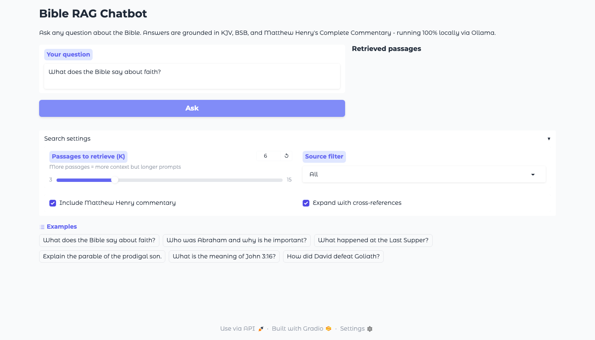
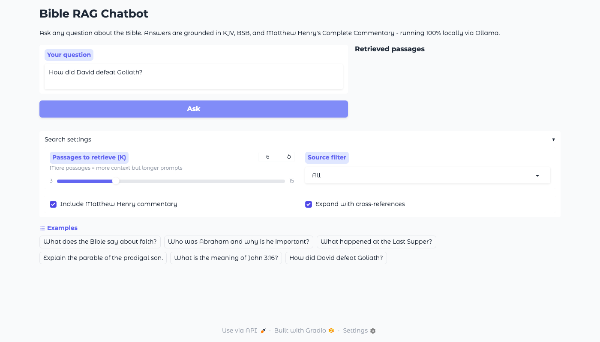
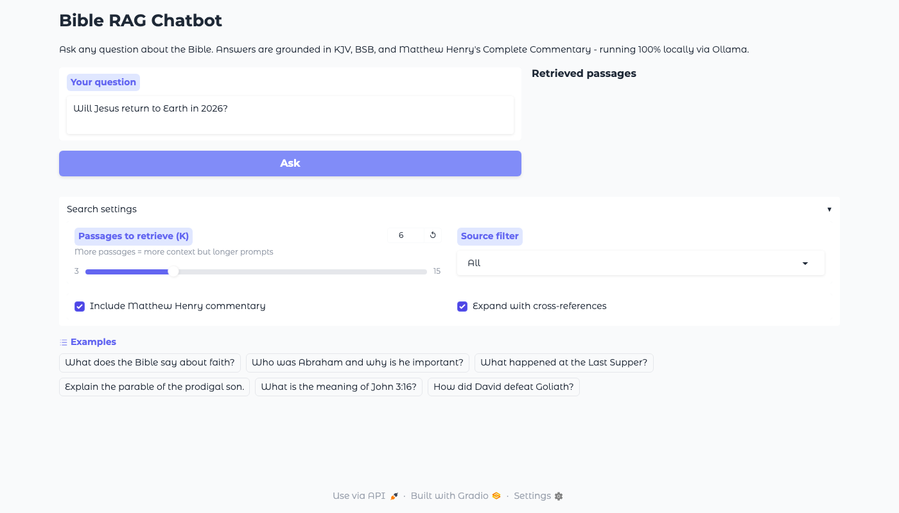

# Bible RAG Chatbot

A locally-hosted retrieval-augmented question-answering system over a 367k-passage heterogeneous corpus: two Bible translations (KJV, BSB), Matthew Henry's 18th-century commentary (1,189 chapters), and a 344k-edge cross-reference graph from OpenBible.info. Runs fully locally with sentence-transformers + FAISS for retrieval, llama3.2 via Ollama for generation, and Gradio for the UI.

## Screenshots

| | |
|---|---|
|  |  |
| *Landing page* | *"What does the Bible say about faith?"* |
|  |  |
| *"How did David defeat Goliath?"* | *"Will Jesus return to Earth in 2026?"* |

## Stack

| Component | Library |
|-----------|---------|
| Embeddings | `sentence-transformers/all-MiniLM-L6-v2` (384-dim, ~22M params) |
| Vector search | FAISS `IndexFlatIP` (exact cosine similarity) |
| LLM | llama3.2 via Ollama |
| UI | Gradio |
| Hardware | Apple Silicon MPS / CPU |

## Features

- Semantic search across 367k indexed passages
- Two translations (KJV + BSB) with two-layer deduplication
- Matthew Henry's Complete Commentary chunked with a sliding 250-word window
- Cross-reference graph expansion over 344k verse-pair links
- Fully local, no data leaves the machine
- Every generated claim is citation-traceable to a source passage

---

## Design Decisions

### Embedding Model

Using `all-MiniLM-L6-v2` from sentence-transformers: 384-dimensional vectors, optimised for semantic similarity, lightweight inference. Fast, low memory usage, good embedding quality. The 384-dim size is a deliberate compromise between semantic representation quality and retrieval efficiency.

Religious texts specifically benefit from semantic embeddings because users tend to ask conceptually framed questions ("what does the Bible say about forgiveness?") rather than exact keyword queries. Sentence-transformer embeddings capture that semantic proximity far better than traditional keyword search.

**Why not TF-IDF or BM25?** Poor semantic understanding. They excel at exact matches but fail on conceptual queries, which is the primary use case here.

**Alternatives considered:**
- Larger sentence-transformers (`all-mpnet-base-v2`, `multi-qa-mpnet-base-dot-v1`): 768-dim, better semantic accuracy and stronger contextual understanding, but slower inference and larger memory footprint
- OpenAI embeddings (`text-embedding-3-small/large`): state-of-the-art retrieval quality and excellent semantic clustering. If launching commercially, these would be worth the trade-offs (API cost, external dependency, network latency)

---

### Vector Index

Using FAISS `IndexFlatIP`: every query is compared against all vectors in the database (exact nearest-neighbour search) to get exact cosine similarity after L2 normalisation. With 65k vectors at 384 dimensions, exact search is still computationally feasible without compromising on approximation errors.

The main limitation is scalability. Since this project is Bible-only, the corpus never needs to grow significantly, so this is not a concern in practice.

**Alternatives considered:**
- `IndexIVFFlat`: approximate search, requires training, introduces retrieval errors that are unnecessary at this scale
- External vector databases (Pinecone, Weaviate, Chroma): better fit if managing vector retrieval as a scalable production system

---

### Chunking Strategy

Bible verses are short and self-contained, so each verse is indexed as a single chunk (1 verse = 1 chunk). Embedding an entire verse preserves its semantic meaning without any loss.

Commentary chapters are much longer. Embedding entire chapters would dilute the meaning and make it harder to retrieve specific arguments. Instead, a sliding 250-word window with 1-sentence overlap is applied: the overlap prevents information loss at chunk boundaries where an argument might span two windows.

**Alternatives considered:**
- Recursive character chunking (LangChain): flexible but less human-interpretable
- Semantic chunking: splits on meaning shifts rather than word count, more expensive to compute
- Token-based chunking: aligns with model limits but less intuitive to reason about

---

### Generation

The LLM is prompted with a strict grounding template:

```
You are a biblical scholar who answers questions using ONLY the provided source passages.
Rules:
- Base your answer strictly on the passages below. Do not add knowledge from outside these passages.
- After each claim, cite the source in parentheses: (KJV Genesis 1:1) or (MHC Matthew 5 commentary).
- If the passages don't contain enough information to answer, say: "The provided passages don't address this directly."
- Be concise but complete. No padding.
```

Temperature is set to `0.0`: minimal creativity, reduced hallucinations, factual consistency, strict adherence to retrieved passages.

---

### Two-Layer Deduplication

**The problem:** with 367k chunks in the index, KJV and BSB both contain every verse. A search for "John 3:16" returns both `kjv:John 3:16` and `bsb:John 3:16` near the top, scoring nearly identically. That wastes two of the k slots on the same content.

**Layer 1 - reference key:** as results come back from FAISS, a key is built from `book + chapter + verse`. The second time the same key appears (regardless of whether it is KJV or BSB), it is skipped. First one in wins.

**Layer 2 - exact score:** even with layer 1, two different chunks (e.g. two MHC commentary windows from the same chapter) can have different reference strings but an identical float32 cosine score. Both would pass layer 1. So seen scores are tracked alongside seen keys, and any chunk whose score has already been emitted is skipped.

The retriever fetches `top_k * 3` candidates upfront to have enough raw results to fill `top_k` slots after dedup removes some.

---

### Cross-Reference Graph Expansion

**The problem:** dense retrieval finds passages that are semantically similar to the query. But some questions require passages that are theologically linked rather than semantically similar. "How does Isaiah 53 relate to Jesus?" will not naturally retrieve Isaiah 53 from a query about Jesus, because they are from different testaments with different vocabulary and the embedding space does not bridge that gap.

The cross-reference graph from OpenBible.info is a 344k-edge directed graph: `verse A -> verse B` means A cross-references B. It encodes human-curated theological connections the embedding model cannot capture.

After dense retrieval returns the top-k results, each retrieved verse is looked up in the graph and its linked verses are appended to the result set, up to `max_extra=3` additional passages. The cap exists because high-degree hub verses (e.g. Psalms 22 links to 170+ verses) would otherwise flood the context and dilute relevance.

---

## Quick Start

**Prerequisites:** Python 3.11+, [Ollama](https://ollama.com)

```bash
git clone https://github.com/qpingWIN/bible-rag-chatbot
cd bible-rag-chatbot
pip install -r requirements.txt

ollama pull llama3.2

# Add data files to data/raw/ (see Data Setup below)

python build_index.py
ollama serve &
python app.py
# open http://localhost:7860
```

## Data Setup

Download and place in `data/raw/`:

| File | Source |
|------|--------|
| `kjv.json` | [scrollmapper/bible_databases](https://github.com/scrollmapper/bible_databases/blob/master/formats/json/KJV.json) |
| `web.json` | [Berean Standard Bible](https://berean.bible) |
| `mhc_commentary.json` | Extract via `data/extract_mhc.py` from the SWORD MHC module |
| `cross_references.txt` | [OpenBible.info](https://www.openbible.info/labs/cross-references/) |

## Project Structure

```
bible-rag-chatbot/
├── app.py                  # Gradio UI
├── build_index.py          # One-time index builder
├── requirements.txt
├── data/
│   ├── raw/                # Source data (not in repo)
│   ├── index/              # FAISS index (generated, not in repo)
│   └── extract_mhc.py
├── src/
│   ├── ingest.py           # Load raw data into Document objects
│   ├── chunker.py          # Verse-level and sliding-window chunking
│   ├── embedder.py         # sentence-transformers wrapper
│   ├── retriever.py        # FAISS index, two-layer dedup, xref expansion
│   └── generator.py        # Ollama prompt construction and generation
└── docs/screenshots/
```

## Data Sources

- **KJV**: [scrollmapper/bible_databases](https://github.com/scrollmapper/bible_databases) - Public Domain
- **BSB**: [Berean Bible](https://berean.bible) - Creative Commons
- **MHC**: Matthew Henry's Complete Commentary (1708-1714) - Public Domain, via [SWORD Project](https://www.crosswire.org/sword/)
- **Cross-references**: [OpenBible.info](https://www.openbible.info/labs/cross-references/) - CC BY 4.0
